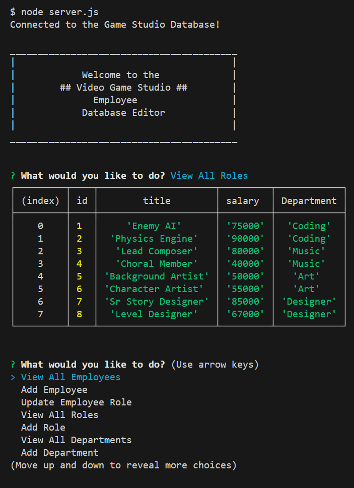

# SQL Employee Tracker

[Link to video]()

## Description
Via a command line interface, users can experience a prototype employee database manager that can track employee names, managers, roles, departments, and salaries. 

## Screenshot

## Installation
* Download the required files to run the app. 
* In the console, use the `npm i` command to install the necessary modules. 
* To set up the database, open up MySql in the command line in the correct folder and use the `mysql -u __ -p` command to start MySQL. 
* Use the `source` command and the correct file path with the `schema.sql` file.
* Still in MySql, use the `source` command, correct file path, and `seeds.sql` file. This seeds the database.

## Usage
* Open the command line in the SQL Employee Tracker folder, and use the `node server.js` command to start the program.
* User the arrow keys to choose the desired task. 
* Input all requested information to create new entries in the database.
* Use the exit option to end the program. 
* Thank you for using this app!

## Future Updates
* Delete entries
* Other view options: by manager, department, etc. 
* Total salaries by department

## References
* [Reference for Self Join](https://learnsql.com/blog/what-is-self-join-sql/)
* [Reference for Concatenate in MySQL](https://www.w3schools.com/sql/trysqlserver.asp?filename=trysql_func_sqlserver_concat_ws2)
* [Reference for the forEach Loop](https://developer.mozilla.org/en-US/docs/Web/JavaScript/Reference/Global_Objects/Array/forEach)
* [Reference for MySQL Update](https://www.w3schools.com/mysql/mysql_update.asp)

## License
Please refer to the license in the repo.

- - -
